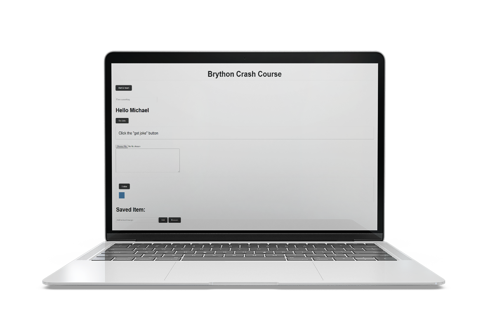
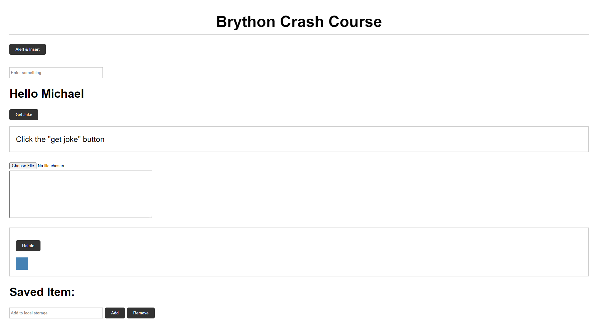

# Python In The Browser Brython

Manipulate the DOM, use local storage, mke Ajax calls, etc using Python in the browser with [Brython](https://brython.info/).

- [x] Setup File
- [x] DOM selection, alert, console
- [x] Text Binding
- [x] Templates & Variables
- [x] Ajax/HTTP
- [x] Load a file
- [x] Style/Rotate
- [x] Local Storage

<h1 align="center">
 
 
</h1>
